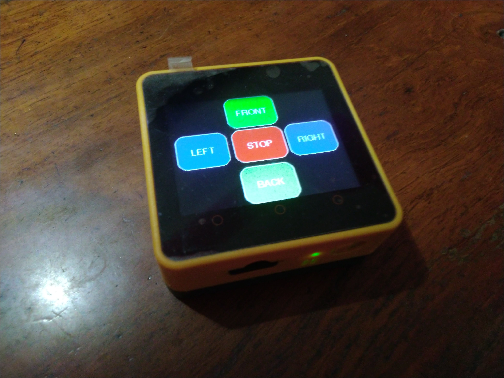
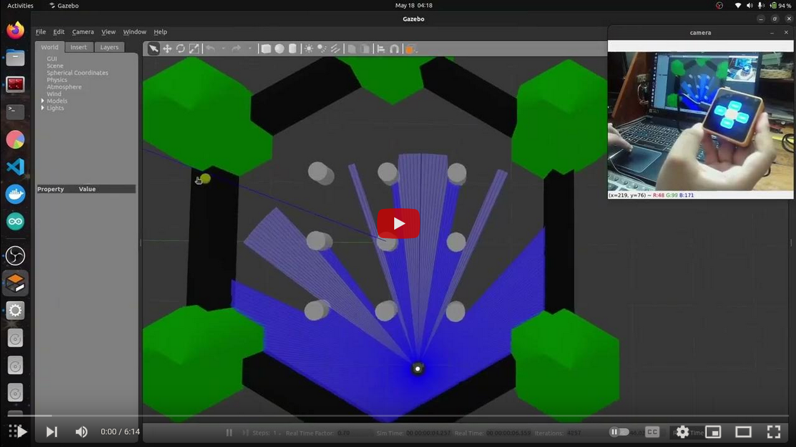

# m5stack_ros_controller
# M5Core2 Touchscreen Joystick using micro-ROS

## Project Details

### Software Used
- Arduino IDE
- micro_ros_arduino library
- M5Core2 library
- ROS 2 Humble Hawksbill
- Turtlebot3 Simulation

### Hardware used 
- M5Stack AWS-M5Core2 (ESP32)

### M5Core2 Touch-screen Joystick

 

### micro-ROS using Serial communication over USB

 

### micro-ROS using UDP communication over WiFi

 

## Demo Video 

 

## Built By 
- [Nilutpol Kashyap](https://github.com/nilutpolkashyap)